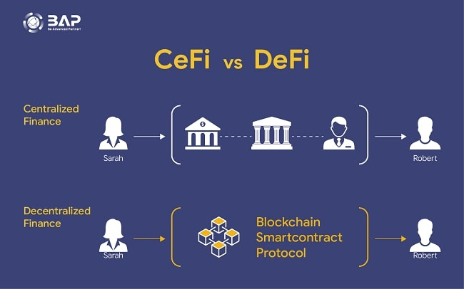

# 💧 Decentralize

<div align="left">

<figure><figcaption><p>Centralized vs Decentralized</p></figcaption></figure>

</div>

#### You MUST have a drip wallet that has a buddy address on the team.&#x20;

## DRIP NETWORK

&#x20;Since April 2021, Drip has been the world's leading ROI platform, providing a daily 1% return in Drip rewards from our proven and sustainable tax system. Join our massive community and start your life-changing passive income journey today!

Use the referral link given to you or you can <mark style="color:green;">CLICK THE LINK BELOW</mark> to get started


DRIP NETWORK TEAM LINK


<details>

<summary>Drip Charts &#x26; Tools</summary>

[https://dripcommunity.wiki/](https://dripcommunity.wiki/)

</details>

A list of **analytics tools**, **dashboards**, and **platforms** that you can use to leverage and maximize wealth in your **Drip Network** journey.

* [📈 **Drip Charts Live**](https://dripcommunity.wiki/tools/live-charts/)
* [📊 **Advanced Drip Charts**](https://dripcommunity.wiki/tools/advanced-charts/)
* [🛡️ **Reservoir Charts**](https://dripcommunity.wiki/tools/reservoir-charts/)
* [📋 **Tools**](https://dripcommunity.wiki/tools/tools/)

```html
<iframe width="640px" height="360px" src="https://defillama.com/chart/chain/All?&theme=dark" title="DefiLlama" frameborder="0"></iframe>
```

<details>

<summary>DISCLAIMER</summary>

Please note that we are not financial advisors, and the information provided below is intended solely for entertainment purposes in the context of decentralized gaming, blockchain markets, and related services. Any actions or decisions taken based on this information are entirely your responsibility. It is essential to consult a qualified professional for financial advice. While the links provided direct you to original websites, please be aware that clicking on any external links is done at your own risk.

Now, let's dive into the fun!

</details>

