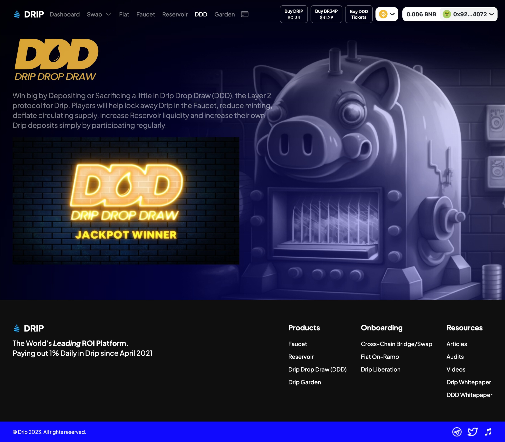

# 🎮 Play to Earn

## PLAY TO EARN

We believe that financial success should be intertwined with joy and excitement. With the rise of play-to-earn gaming, we seize the opportunity to merge investment opportunities with immersive gaming experiences. Our portfolio includes carefully selected play-to-earn gaming projects, where players can earn rewards, assets, and cryptocurrencies by participating in captivating virtual worlds. We understand that investing should be rewarding in more ways than one, and we invite you to join us on this thrilling journey.


Check out [<mark style="color:purple;">**Blockchain Babies**</mark>](broken-reference) for kid friendly games


<table data-view="cards"><thead><tr><th></th><th></th><th></th><th data-hidden data-card-cover data-type="files"></th></tr></thead><tbody><tr><td>Play to Earn</td><td>New User Start</td><td>Register<a href="https://forms.gle/QnDZj7eQpzUDe52EA"> HERE</a></td><td><a href="../.gitbook/assets/FCNN EARN.png">FCNN EARN.png</a></td></tr><tr><td></td><td></td><td></td><td><a href="../.gitbook/assets/bcmhunt.png">bcmhunt.png</a></td></tr><tr><td></td><td></td><td></td><td><a href="../.gitbook/assets/SHIBARIUM (2).PNG">SHIBARIUM (2).PNG</a></td></tr><tr><td></td><td></td><td></td><td><a href="../.gitbook/assets/zedrun.png">zedrun.png</a></td></tr></tbody></table>



<table data-view="cards"><thead><tr><th></th><th></th><th></th><th data-hidden data-card-cover data-type="files"></th></tr></thead><tbody><tr><td></td><td></td><td></td><td><a href="../.gitbook/assets/upland-4218759582.jpg">upland-4218759582.jpg</a></td></tr><tr><td></td><td></td><td></td><td></td></tr><tr><td></td><td></td><td></td><td></td></tr></tbody></table>



<table data-view="cards"><thead><tr><th></th><th></th><th></th><th data-hidden data-card-cover data-type="files"></th></tr></thead><tbody><tr><td></td><td></td><td></td><td><a href="../.gitbook/assets/mobland.jpg">mobland.jpg</a></td></tr><tr><td></td><td></td><td></td><td></td></tr><tr><td></td><td></td><td></td><td></td></tr></tbody></table>



<table data-view="cards"><thead><tr><th></th><th></th><th></th><th data-hidden data-card-cover data-type="files"></th></tr></thead><tbody><tr><td></td><td></td><td></td><td><a href="../.gitbook/assets/bcmc.jpg">bcmc.jpg</a></td></tr><tr><td></td><td></td><td></td><td></td></tr><tr><td></td><td></td><td></td><td></td></tr></tbody></table>



<figure><figcaption></figcaption></figure>

<figure><figcaption></figcaption></figure>

📢  Team Requirement Outline

* [ ] Social Media : Follow, Like, Subscribe to  any and/or all of our accounts....Comment with your wallet address to be added to the airdrop pools.
* [ ] Decentralized Protocols: Must have a Drip wallet on the team. Optional but highly encourged protocols are AnimalFarm and BNB Miner.
*

⁂ In Gaming as in Life Magic is the Art of Transforming Reality into Something Better ⁂

**⁂GAMERz🌀GUILDz⁂ ((Æ1st Interactive Gamerz Play to Earn Launchpad ))**

Where we search the blockchain and share play to earn and play to learn gaming protocols. ..

⁂Blockchain🌀Babies⁂ Here we will list if the game presented is ok for 18yrs and under

## PLAY TO EARN

Use the referral link given to you or you can [<mark style="color:green;">CLICK THE LINK</mark>](https://forms.gle/KD5bkL8FrgSuRuvWA)  to get started

Animal Farm Charts &#x26; Tools

[https://animalfarm.wiki/](https://animalfarm.wiki/)

* [ ] [https://youtube.com/@Gam3rzGu7ldz](https://youtube.com/@Gam3rzGu7ldz)
*


[disclaimer.md](../policies/disclaimer.md)

