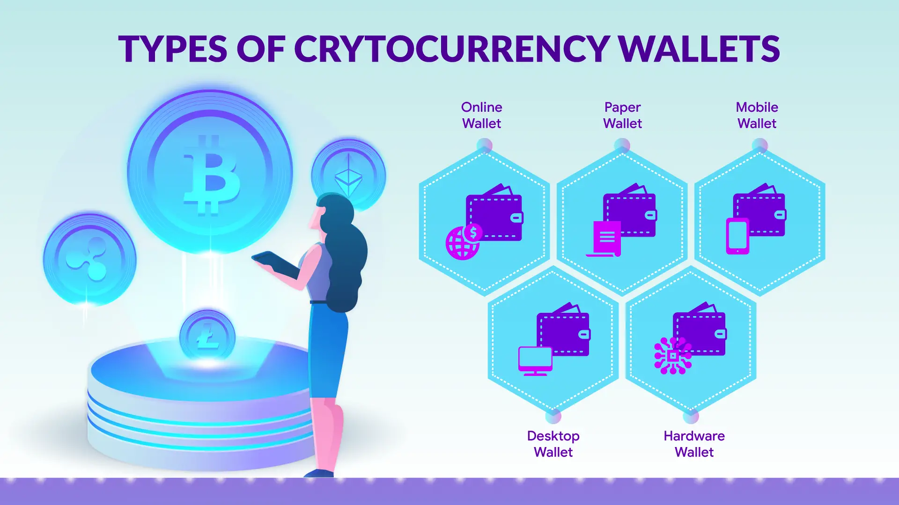

# 🆕 NEW TO CRYPTO

## Your Steps, on your Time...

#### &#x20; [This community](broken-reference) is incredibly friendly, supportive, and understanding. Whether you have questions, need guidance, or [just want to chat,](broken-reference) there are plenty of experienced members ready to lend a helping hand. Remember, everyone started as a newbie at some point, and your unique perspective and fresh ideas are highly valued. So take a deep breath, embrace this exciting journey, and know that you're in a safe and welcoming space where you can learn, grow, and have a great time! 




<figure><figcaption>
<a href="broken-reference">What is a Cryptocurrency Wallet?</a>
</figcaption></figure>

**You need a Cryptocurrency Wallet to interact with Blockchain Technology**

1. [Why?](./#cryptowallet) A crypto wallet is a tool that allows you to interact with a blockchain network.
2. Where? [<mark style="color:yellow;">Where do you get a wallet from.</mark>](./#cryptowallet)
3. Which one should i choice?....[<mark style="color:red;">Help</mark>](../../research-and-development/foxxchain.wiki/cryptocurrency-wallets/qs.foxxchain-network/#qs.foxxchain-network)
4. [<mark style="color:green;">Ok let me try it out...</mark>](https://forms.gle/dvT48bnJpZ1XWQzJ9)



**Get Plugged in, Social Media Networks allow 24/7 Chat help and Updates!**

<figure><figcaption>
<a href="../../research-and-development/foxxchain.wiki/cryptocurrency-wallets/qs.foxxchain-network/#qs.foxxchain-network">Foxxchain.io </a>
</figcaption></figure>

1. Drop your wallet address in the [Social Media Network](../../social-media-links/social-media-network.md) of your choice, to be eligible for Foxxchain Community Airdrops, Raffles and Giveaways.
2.
3.




<figure><figcaption>
DeFi Finance
</figcaption></figure>

 

<figure><figcaption>
Staking/Farming/Gaming
</figcaption></figure>

 

<figure><figcaption>
%1 Compounding Interest
</figcaption></figure>

Let's Get Decentralized!

1. Join the Foxxchain Drip Network Team to start your new Defi Portfolio.







Registration is open for Learn While you Earn Protocol, add value to the community while adding Value to your Cryptocurrency Wallets.

<figure><figcaption>
Register Now!
</figcaption></figure>




